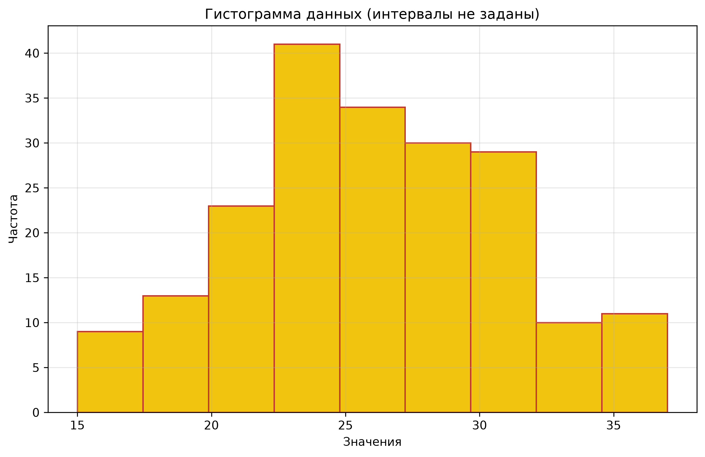

# Проверка однородности совокупности значений признака

Дисциплина «Алгоритмизация и программирование», курсовая работа.

## Задача

Требуется разработать консольное приложение, которое проверяет
однородность совокупности значений признака для интервальных рядов.
Однородной считается выборка, в которой коэффициент вариации не
превышает 33%. Если значение выше, совокупность признаётся
неоднородной, и её дальнейшее использование в статистическом анализе
требует осторожности.

## Исходные данные

Рассматриваются два формата входных данных.

Первый - файл, в котором перечислены отдельные значения признака
по одному в строке. Количество наблюдений - 200. Интервалы
формируются внутри программы по формуле Стерджесса.

Второй - файл, в котором уже заданы границы интервалов и частота
попадания значений в каждый интервал. Формат строки - три числа:
нижняя граница, верхняя граница, количество значений.

## Методология

Количество интервалов определяется по формуле Стерджесса
`k = 1 + 3.322 * log10(n)`. Ширина интервала рассчитывается как
отношение размаха к количеству интервалов. Для каждого интервала
вычисляется середина, которая используется как представитель всех
входящих в него значений.

По сгруппированным данным рассчитываются три коэффициента. Первый
- коэффициент вариации, равный отношению стандартного отклонения
к среднему значению и выраженный в процентах. Второй - коэффициент
осцилляции, равный отношению размаха к среднему. Третий - линейный
коэффициент вариации, равный отношению среднего линейного отклонения
к среднему значению.

Если коэффициент вариации меньше 33%, совокупность признаётся
однородной. В противном случае - неоднородной.

## Результаты

Для файла с отдельными значениями коэффициент вариации, коэффициент
осцилляции и линейный коэффициент вариации рассчитаны по
сгруппированным данным. Совокупность признана однородной, поскольку
коэффициент вариации не превышает порогового значения.

Для файла с заданными интервалами аналогичные показатели рассчитаны
напрямую по частотам. Результат совпадает: совокупность однородна.

## Стек

Python, numpy, matplotlib.