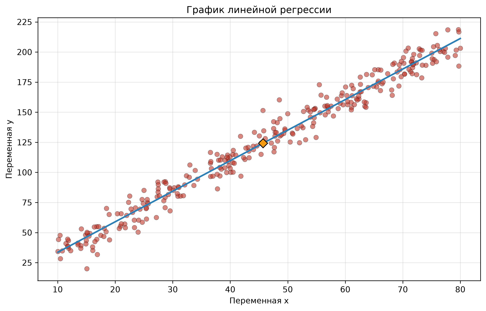
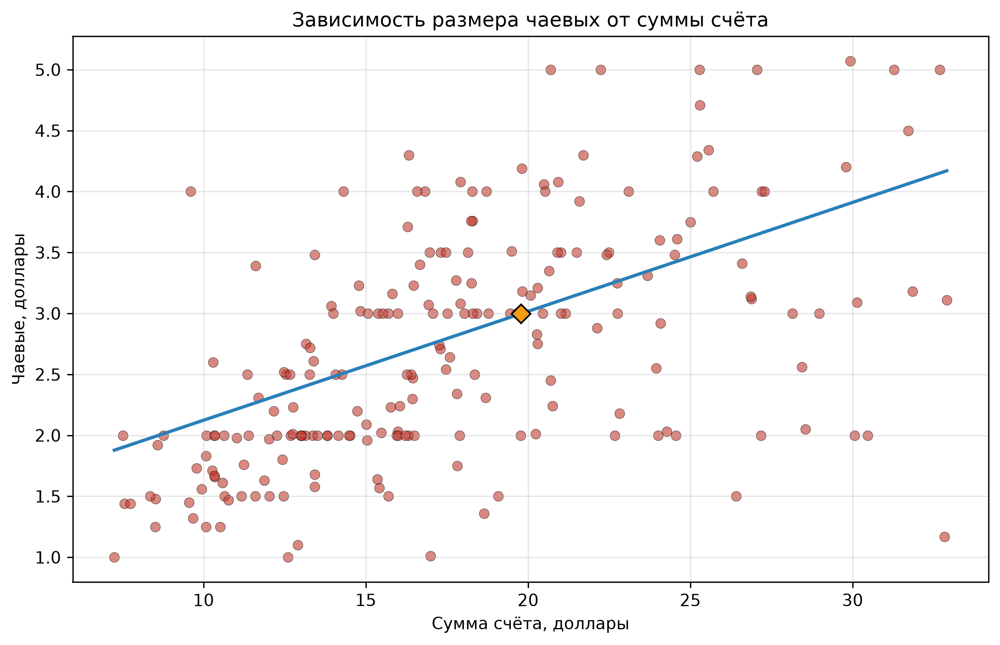

# Оценка параметров линейной регрессии

Дисциплина «Алгоритмизация и программирование», курсовая работа.

## Задача

Требуется разработать консольное приложение, которое по набору
пар значений двух признаков строит уравнение линейной регрессии,
оценивает тесноту связи между переменными и проверяет статистическую
значимость уравнения в целом. Отдельное внимание уделено
предварительной очистке выборки от выбросов, поскольку их наличие
искажает оценки коэффициентов и снижает качество модели.

## Исходные данные

Рассматриваются два варианта входных данных.

Первый - синтетический набор, сгенерированный по линейному закону
`y = 2.5 * x + 10` с гауссовским шумом, а также с тремя искусственно
добавленными выбросами, которые должны быть отсеяны алгоритмом. Объём
выборки - 303 наблюдения до очистки и 300 после.

Второй - открытый датасет `tips` из библиотеки `seaborn`, содержащий
244 наблюдения по счетам в ресторане. Исследуется зависимость размера
чаевых от суммы счёта.

## Методология

Алгоритм состоит из нескольких последовательных шагов.

На первом шаге для каждого признака вычисляются среднее значение и
стандартное отклонение. Границы допустимых значений определяются
правилом полуторного интервала: `mean ± 1.5 * std`. Наблюдения,
выходящие за эти границы хотя бы по одной из переменных, считаются
выбросами и удаляются.

На втором шаге по очищенной выборке вычисляются коэффициенты
линейной регрессии через метод наименьших квадратов. Коэффициент
корреляции рассчитывается как нормированная ковариация, коэффициент
детерминации - как его квадрат. Для проверки значимости уравнения
вычисляется эмпирическое значение критерия Фишера и сравнивается
с табличным, полученным через обратную функцию распределения
Фишера при уровне значимости 0.05.

Графическое представление включает диаграмму рассеяния, линию
регрессии и точку средних значений.

## Результаты

На синтетических данных алгоритм восстановил исходную зависимость
практически без искажений. Полученное уравнение `y = 2.538 * x + 8.187`
близко к истинному `y = 2.5 * x + 10`. Коэффициент корреляции
составил 0.99, коэффициент детерминации 0.98. Эмпирическое значение
F-критерия многократно превышает табличное, что подтверждает
статистическую значимость уравнения.

На датасете `tips` связь оказалась умеренной: уравнение
`y = 0.0894 * x + 1.2303`, коэффициент корреляции 0.61,
коэффициент детерминации 0.37. Сумма счёта объясняет около 37%
вариации размера чаевых, остальное приходится на другие факторы.
Уравнение также статистически значимо на уровне 0.05.

## Стек

Python, numpy, scipy.stats, matplotlib, seaborn.